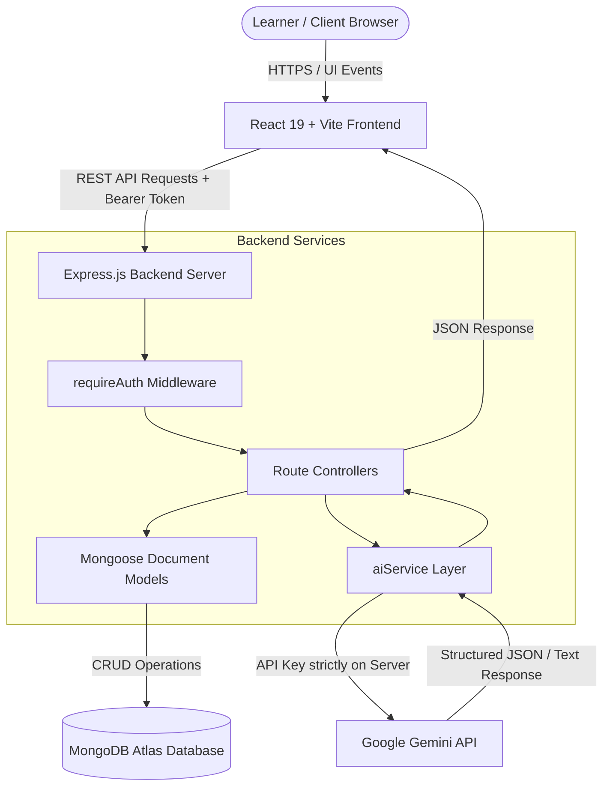

# LearnWise AI — AI-Powered Personalized Learning Workspace

**Author:** Shreyasi Tyagi  
**Repository:** [LearnWise AI](https://github.com/shreyasityagi/learnwise-ai)  
**License:** ISC  

---

## 1. Overview

**LearnWise AI** is a full-stack personalized learning platform designed to help students, beginners, and developers master technical skills with structure, focus, and real-time guidance. 

Self-directed learners frequently struggle with scattered resources, lack of structured roadmaps, static quizzes without feedback, and generic chatbots that lack learning context. LearnWise AI solves these challenges by combining dynamic AI curriculum generation, progress tracking, server-evaluated technical practice, and a context-aware AI learning mentor into a unified workspace.

### Key Capabilities
- **Secure Authentication:** User accounts with encrypted credentials and JWT-based session security.
- **Personalized AI Roadmaps:** Custom learning paths generated based on your target goal, current skill level, and available study hours.
- **Persistent Progress Tracking:** Mark roadmap steps as completed and monitor topic completion across sessions.
- **Curated Resource Search:** Discover prioritized documentation, courses, and tutorials for any technical topic.
- **Resource Bookmarking:** Save and organize valuable learning links directly to your account.
- **Server-Evaluated AI Practice:** Test your understanding with 5-question multiple-choice quizzes where answers are securely graded on the backend.
- **Context-Aware AI Mentor:** A dedicated technical tutor that tailors explanations and debugging advice using your active roadmap and practice performance.
- **Centralized Dashboard:** View active milestones, progress completion rates, saved resources, and latest quiz scores at a glance.

---

## 2. Key Features

### 🔐 Authentication & User Isolation
- Passwords securely hashed using `bcryptjs`.
- Stateless session management with signed JSON Web Tokens (`jsonwebtoken`).
- Protected API routes verified via custom `requireAuth` middleware.
- Strict data isolation ensuring users can only read and mutate their own roadmaps, bookmarks, progress, and practice attempts.

### 🗺️ AI-Generated Learning Roadmaps
- Users configure their experience level (*Beginner*, *Intermediate*, *Advanced*), learning goal, and weekly study time.
- The backend prompts Google Gemini to generate structured sequential steps containing learning focus, estimated time, and recommended resources.
- Roadmaps are saved directly to MongoDB Atlas with full update and deletion capabilities.

### 📈 Progress Tracking
- Topic completion is stored as unique user progress records in MongoDB.
- Aggregated metrics dynamically calculate overall roadmap completion percentages.
- The state persists across reloads and syncs directly with the main dashboard.

### 🤖 Context-Aware AI Mentor
- Secure, authenticated backend endpoint (`POST /api/learning/mentor`) calling Gemini strictly server-side.
- The server aggregates user learning context (active goal, level, completed topics, next upcoming milestone, and latest practice score) to personalize tutor responses.
- Client-side conversation state maintains context across follow-ups, with a rolling history window sent to the server.
- Tailored for computer science and software development: provides code blocks with copy support, step-by-step reasoning, and conceptual check questions.
- **Gemini Quota Handling:** Distinguishes transient rate limits from non-retryable daily quota errors to fail fast without wasting retries.

### 📝 AI Practice Center & Server-Side Evaluation
- Generates 5 targeted multiple-choice questions aligned with your learning context.
- **Cheat-Proof Architecture:** Correct answer indices and explanations are withheld on the server during question generation.
- The user submits their answer sheet to `POST /api/learning/practice/submit`, where the backend grades each response, calculates the percentage score, and marks the attempt as submitted.
- Prevents duplicate quiz submissions and saves all attempts to MongoDB for longitudinal tracking.

### 🔍 Curated Learning Resources & Bookmarks
- On-demand AI resource recommendations categorizing resources into Documentation, Courses, Videos, and Practice.
- Search queries are user-triggered to avoid unnecessary AI API consumption.
- One-click bookmarking persists favorite resources to MongoDB for fast reference.

### 📊 Dashboard
- Real-time aggregation of completed topics, daily study goals, and total bookmarks.
- Displays latest quiz score, percentage, and date.
- Visual roadmap completion bar with a direct link to resume your next incomplete topic.

---

## 3. Tech Stack

| Layer | Technology | Purpose |
| :--- | :--- | :--- |
| **Frontend UI** | React 19, Vite | Single-Page Application (SPA) with fast HMR |
| **Styling** | Tailwind CSS v4 | Clean, responsive design tokens & typography |
| **Icons** | Lucide React | Modern, consistent interface icons |
| **Routing** | React Router 7 | Client-side routing with protected route wrappers |
| **HTTP Client** | Axios | REST client with automatic JWT authorization interceptors |
| **Backend API** | Node.js, Express.js | RESTful HTTP service with modular routes & controllers |
| **Database** | MongoDB Atlas, Mongoose | Cloud NoSQL document persistence & schema validation |
| **Authentication** | JWT, bcryptjs | Encrypted password storage & bearer token authorization |
| **AI Layer** | Google Gemini API (`@google/generative-ai`) | Structured JSON generation & conversational text tutor |

---

## 4. Architecture & Data Flow



### Why AI Requests are Backend-Only
1. **API Key Protection:** The `GEMINI_API_KEY` is never shipped in frontend bundles or exposed to client browsers.
2. **Context Enrichment:** The backend queries MongoDB for the user's active roadmap, completed topics, and quiz performance to enrich the prompt before calling Gemini.
3. **Controlled Cost & History:** History length is limited server-side to 10 messages to avoid token blowups and respect quota boundaries.
4. **Answer Integrity:** Quiz answer keys remain strictly on the server until the user submits their answers.

---

## 5. Application Flow

```text
User Registration / Login
  ↓ (JWT issued & stored in localStorage)
Dashboard / Workspace Navigation
  ↓
Create Roadmap ───► Gemini generates steps ───► Saved to MongoDB
  ↓
Learn & Progress ──► Mark steps completed ────► Progress aggregated in Dashboard
  ↓
Search Resources ─► Gemini recommends links ─► Bookmark favorites to MongoDB
  ↓
Take Practice ────► 5 MCQs generated ────────► Answers evaluated & saved server-side
  ↓
Ask AI Mentor ────► Context-aware tutoring ──► Real-time code & conceptual explanations
```

---

## 6. Data Models (MongoDB Atlas)

The backend utilizes 5 Mongoose models registered in MongoDB:

| Collection | Model Name | Description |
| :--- | :--- | :--- |
| `users` | `User` | User credentials (`name`, `email`, `password_hash`, timestamps). |
| `roadmaps` | `Roadmap` | User roadmaps (`user_id`, `level`, `goal`, `study_time`, `steps` array). |
| `progressitems` | `ProgressItem` | Individual step completion records (`user_id`, `category`, `item_key`, `label`, `status`). Indexed uniquely on `(user_id, category, item_key)`. |
| `bookmarks` | `Bookmark` | Saved learning resources (`user_id`, `title`, `type`, `difficulty`, `duration`, `url`, `source`). |
| `practices` | `Practice` | Quiz attempts containing 5 questions, submitted answers, `score`, `percentage`, and `isSubmitted` state. |

---

## 7. API Endpoints

All routes (except health and public auth) require the `Authorization: Bearer <token>` header.

### 🔐 Authentication (`/api/auth`)
- `POST /api/auth/register` — Register a new account (`name`, `email`, `password`).
- `POST /api/auth/login` — Authenticate and receive a JWT token (`email`, `password`).
- `GET /api/auth/me` *(Protected)* — Retrieve current authenticated user profile.

### 📚 Learning & AI Features (`/api/learning`)
- `GET /api/learning/search?q={query}` *(Protected)* — Search categorized learning resources via Gemini.
- `POST /api/learning/roadmap` *(Protected)* — Generate and create a new personalized roadmap.
- `GET /api/learning/roadmap` *(Protected)* — List all roadmaps belonging to the authenticated user.
- `GET /api/learning/roadmap/:id` *(Protected)* — Fetch a single roadmap by ID.
- `PUT /api/learning/roadmap/:id` *(Protected)* — Update an existing roadmap.
- `DELETE /api/learning/roadmap/:id` *(Protected)* — Delete a roadmap.
- `GET /api/learning/bookmarks` *(Protected)* — List all saved bookmarks.
- `POST /api/learning/bookmarks` *(Protected)* — Save a resource bookmark.
- `DELETE /api/learning/bookmarks/:id` *(Protected)* — Remove a bookmark by ID.
- `POST /api/learning/practice/generate` *(Protected)* — Generate a 5-question AI quiz (answers withheld).
- `POST /api/learning/practice/submit` *(Protected)* — Submit quiz answers for server evaluation.
- `GET /api/learning/practice/latest` *(Protected)* — Retrieve latest submitted practice performance.
- `POST /api/learning/mentor` *(Protected)* — Send a query to the context-aware AI Mentor.

### 📈 Progress Tracking (`/api/progress` & `/api/learning/progress`)
- `GET /api/progress` *(Protected)* — List all progress records for the user.
- `GET /api/progress/summary` *(Protected)* — Aggregated summary count of completed items by category.
- `POST /api/progress` *(Protected)* — Upsert status for a specific item key.

### 🩺 Health (`/api/health`)
- `GET /api/health` *(Public)* — Health status check returning `{ status: "ok" }`.

---

## 8. Environment Variables

### Backend Configuration (`backend/.env`)
Copy `backend/.env.example` to `backend/.env`:

```env
PORT=5000
CORS_ORIGIN=http://localhost:5173
MONGODB_USERNAME=your_mongodb_username
MONGODB_PASSWORD=your_mongodb_password
JWT_SECRET=your_jwt_secret_key_here
GEMINI_API_KEY=your_gemini_api_key_here
GEMINI_MODEL=gemini-3.6-flash
```

### Frontend Configuration (`frontend/.env`)
Copy `frontend/.env.example` to `frontend/.env`:

```env
VITE_API_BASE_URL=http://localhost:5000/api
```

---

## 9. Local Setup & Installation

### Prerequisites
- **Node.js**: v18.0.0 or higher
- **npm**: v9.0.0 or higher
- **MongoDB Atlas** cluster or local MongoDB instance
- **Google Gemini API Key** (from Google AI Studio)

### Step 1: Clone the Repository
```bash
git clone https://github.com/shreyasityagi/learnwise-ai.git
cd learnwise-ai
```

### Step 2: Configure & Start the Backend
```bash
cd backend
npm install

# Create environment file from template
cp .env.example .env
# Edit .env with your MongoDB credentials, JWT secret, and Gemini API key

# Start development server
npm run dev
```
*The backend API will be available at `http://localhost:5000`.*

### Step 3: Configure & Start the Frontend
```bash
# In a separate terminal tab
cd ../frontend
npm install

# Create environment file from template
cp .env.example .env

# Start Vite development server
npm run dev
```
*The React client will be accessible at `http://localhost:5173`.*

---

## 10. Project Structure

```text
learnwise-ai/
├── .gitignore                         # Root Git ignore (secrets, node_modules, dist)
├── README.md                          # Project documentation
├── docs/
│   └── phase-0.md                     # Architectural planning reference
├── backend/
│   ├── .env.example                   # Backend environment template
│   ├── .gitignore
│   ├── package.json
│   ├── package-lock.json
│   └── src/
│       ├── app.js                     # Express middleware & route setup
│       ├── server.js                  # Database connection & HTTP listen
│       ├── config/
│       │   └── db.js                  # Mongoose MongoDB connection pool
│       ├── controllers/               # Request handling & business logic
│       ├── middleware/                # Auth, async error, global error handlers
│       ├── models/                    # Mongoose schemas (User, Roadmap, Practice, etc.)
│       ├── routes/                    # API route definitions
│       ├── services/                  # Gemini AI service (generateJson, generateText)
│       └── utils/                     # Validation utilities
└── frontend/
    ├── .env.example                   # Frontend environment template
    ├── .gitignore
    ├── .oxlintrc.json
    ├── index.html
    ├── package.json
    ├── package-lock.json
    ├── vite.config.js
    ├── public/
    │   ├── ai_tutor.jpg               # AI Mentor mascot graphic
    │   └── favicon.svg
    └── src/
        ├── App.jsx                    # Route registration & AuthProvider wrapper
        ├── index.css                  # Tailwind CSS v4 design tokens
        ├── components/                # Reusable UI components (Cards, Buttons, Badges)
        ├── context/                   # AuthContext state & login/logout handlers
        ├── layout/                    # AppShell navigation & header
        ├── pages/                     # Application views (Dashboard, Roadmap, Mentor, etc.)
        └── services/                  # Axios instance & API client functions
```

---

## 11. Security & Best Practices

- **Strict Server-Side Secrets:** Gemini API keys, MongoDB credentials, and JWT signing keys remain exclusively on the server.
- **Password Security:** Salted hashes using `bcryptjs` prevent plaintext password storage.
- **Input Validation:** Required field validations enforce data integrity before processing database mutations or AI queries.
- **Isolated User Scope:** All database reads and writes filter by `req.user.id` derived from verified JWT headers.
- **Git Protection:** Comprehensive `.gitignore` configurations prevent `.env` files and build outputs from being tracked in version control.

---

## 12. Current Status & Future Improvements

### Current Status
The core application foundation is fully implemented, verified, and running end-to-end:
- Authentication & route protection
- Roadmap generation, modification, and persistence
- AI-driven practice quiz generation and server-side grading
- Dynamic, context-aware AI Mentor
- Dashboard metrics and resource bookmarking

### Future Enhancements
- [ ] Automated end-to-end test suite (Playwright / Cypress) and backend unit tests (Jest / Supertest).
- [ ] Production containerization using Docker & Docker Compose.
- [ ] Cloud deployment on AWS / Render / Vercel with automated CI/CD pipelines.
- [ ] Project Recommendations generator based on completed roadmap milestones.
- [ ] Advanced learning analytics and streak tracking.

---

## 13. Author

**Shreyasi Tyagi**  
- GitHub: [@shreyasityagi](https://github.com/shreyasityagi)  
- Project: [LearnWise AI](https://github.com/shreyasityagi/learnwise-ai)
