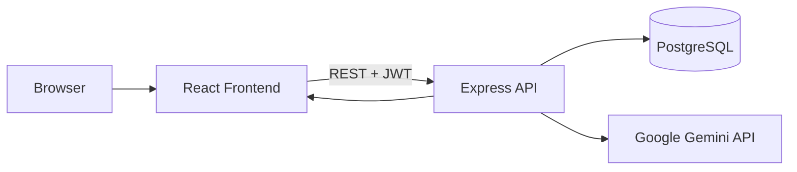

# Phase 0 - Product Planning

This document turns the LearnWise AI PRD into an implementation-ready plan.

## Objective

Define the product scope, technical direction, folder structure, and architecture before building user-facing features.

## Why we are doing this first

The product spans learning search, roadmap generation, AI chat, authentication, dashboard state, and deployment. A clear foundation keeps the project maintainable and prevents us from building screens or APIs that do not fit together later.

## Core product modules

- Smart search
- Personalized roadmap generation
- AI mentor chat
- Dashboard
- Practice center
- Project recommendations
- Bookmarks
- Authentication

## MVP priority order

1. Authentication
2. Core app shell and navigation
3. Smart search
4. Roadmap generation
5. Dashboard
6. Bookmarks
7. AI mentor streaming
8. Practice and project recommendation tools

## Folder structure

### Frontend

- `src/components`: reusable UI building blocks
- `src/pages`: route-level screens
- `src/routes`: route definitions and guards
- `src/services`: API client layer
- `src/store`: shared client state
- `src/utils`: reusable helpers

### Backend

- `src/config`: environment and infrastructure setup
- `src/controllers`: request handlers
- `src/middleware`: auth, validation, and error handling
- `src/models`: database access and domain models
- `src/routes`: API route registration
- `src/services`: business logic and AI integrations
- `src/validators`: request validation schemas
- `src/server.ts`: backend bootstrap entry point

## Important files to keep in mind

- `frontend/src/App.tsx`: top-level routing shell
- `frontend/src/main.tsx`: frontend bootstrap file
- `frontend/src/index.css`: global styles and theme tokens
- `backend/src/server.ts`: Express app startup and middleware setup
- `backend/src/config/db.ts`: PostgreSQL connection pool

## Architecture

## Data flow

1. The user visits the React app.
2. The app sends API requests to the Express backend.
3. The backend validates input and checks authentication where needed.
4. The backend reads from or writes to PostgreSQL.
5. AI features are requested through backend-only Gemini calls.
6. The backend returns JSON or streamed AI output to the frontend.

## Build principles

- Keep API keys on the server only
- Validate user input on the backend
- Use protected routes for authenticated pages
- Make the UI responsive from day one
- Build for production behavior, not demo-only behavior
